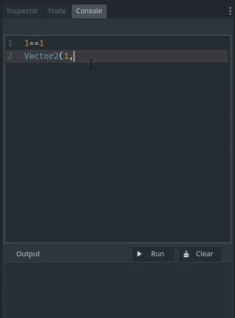
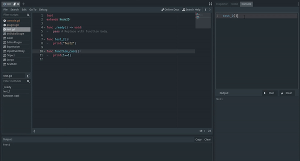
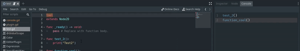
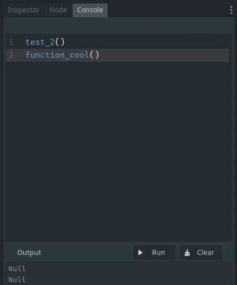
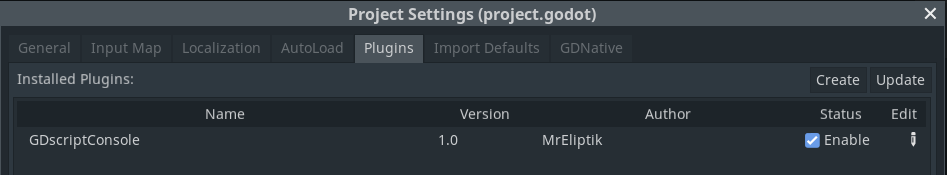

  

GDScript Console is an editor addon giving the ability to run GDScript and call functions from the currently edited scene.

Made for the [Godot Addon Jam](https://itch.io/jam/godot-addons-jam-1). [Itch page](https://mreliptik.itch.io/gdscript-console)

## Features

In editor GDScript console. Type any GDScript expression and hit `Run` to get the result in the output console.

  

Execute code from the currently edited scene. Simply call the function you want and hit `RUN`

  

`Tool warning!` Tells you if the script is not a `tool`

  

Zoom in and out, just like in the editor!

  

## How to use

Type your expression in the console and hit `RUN` to get the result in the output window.

You can also call function from the currently edited scene. Simply call your function, as usual.

**Note: The print() output will be in the usual output window of Godot**

## How to install

Extract the `gdscript_console` folder into the `addons` folder of you project (create one if needed).

  

Then head to `Project Settings > Plugins` and enable `GDscriptConsole`. You'll see a console tab appear in the right dock, next to Inspector and Node.

## LICENSE

This project is distrbuted as-is, under the MIT license. Check [LICENSE](LICENSE) for more detail.

Made by [MrEliptik](https://twitter.com/mreliptik_) for the [Godot Addon Jam](https://itch.io/jam/godot-addons-jam-1)